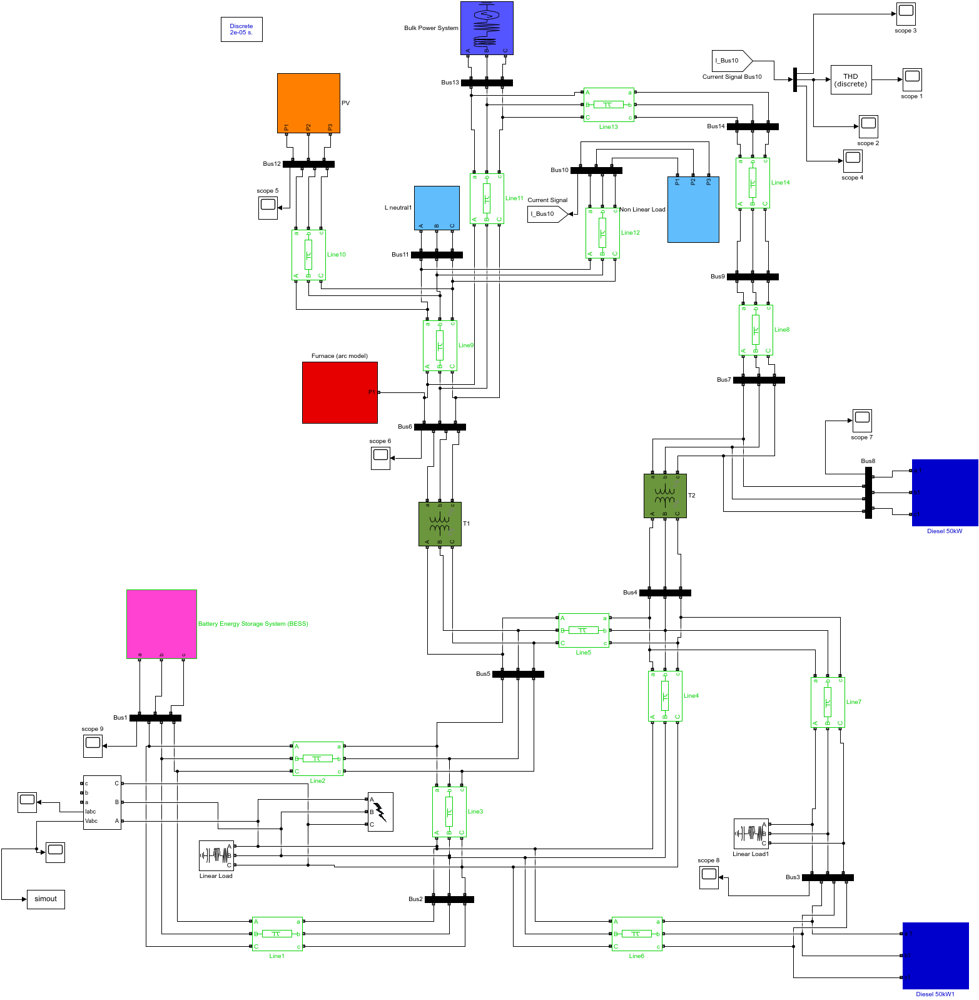
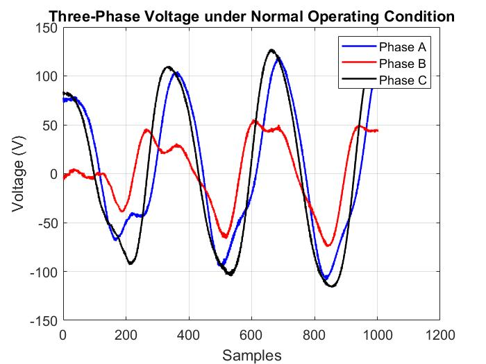
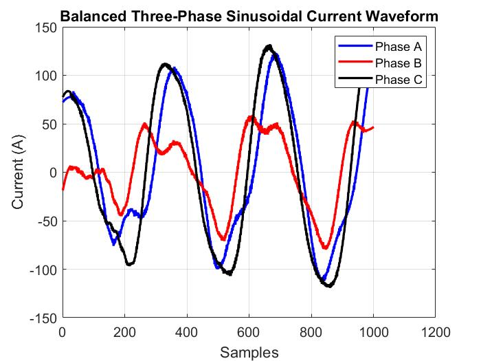
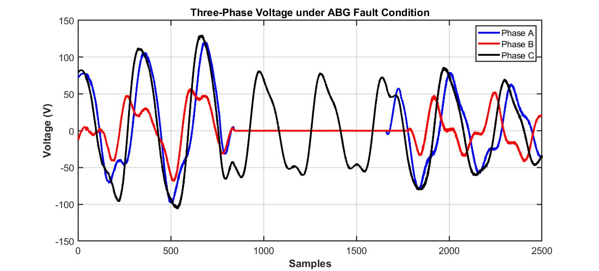
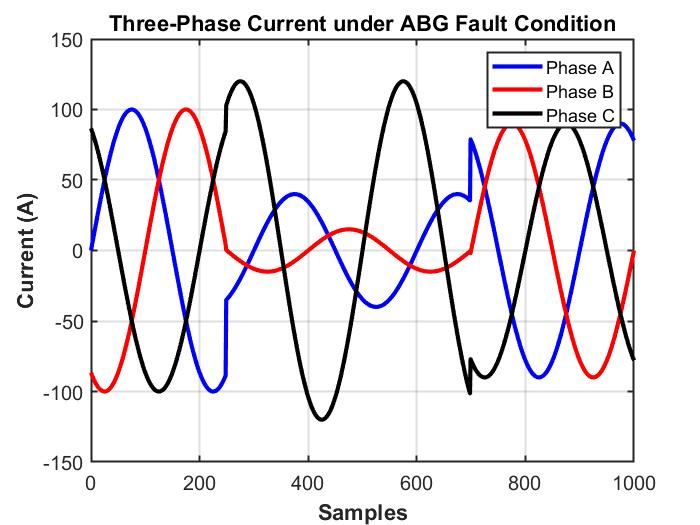

# ⚡ Detection of Fault in a DG Integrated Power System

> **A 13-bus Distributed Generation (DG) integrated microgrid — modeled, simulated, and stress-tested under fault conditions in MATLAB/Simulink.**


---

## 🔍 What This Project Does

Modern microgrids mix solar, batteries, diesel generators, and nonlinear industrial loads — which makes **fault detection far harder than in a conventional grid**. Fault currents are lower, bidirectional, and easily masked by harmonics.

This project builds a complete **13-bus DG integrated power system** in Simulink and answers one question:

> *What actually happens to voltage, current, and stability when a double line-to-ground (ABG) fault strikes a DG-rich network?*

**Spoiler:** phase collapse, fault current surges, waveform distortion — all captured and analyzed below. 👇

---

## 🗺️ The System Model

A full microgrid in one Simulink canvas — **14 buses, 14 transmission lines, 2 transformers**, and a diverse generation + load mix:

| Component | Role |
|-----------|------|
| 🏭 Bulk Power System | Main grid source |
| ☀️ PV Array | Renewable generation |
| 🔋 Battery Energy Storage (BESS) | Energy balancing & backup |
| ⛽ 2 × 50 kW Diesel Generators | Conventional DG support |
| 🔥 Arc Furnace Model | Nonlinear industrial load (harmonics) |
| 📊 THD Analysis Block | Power quality monitoring |
| ⚡ Fault Block | Injects the ABG (Phase A + B → Ground) fault |





*The complete 13-bus DG integrated microgrid — discrete solver, 2e-05 s sample time.*

---

## 📉 Results: Normal vs. Fault

### ✅ Normal Operation — balanced and stable

| Voltage | Current |
|---------|---------|
| 



 | 



 |

All three phases follow a clean, near-sinusoidal pattern — generation and load are in harmony.

### 🚨 ABG Fault Applied — the system under attack

| Voltage | Current |
|---------|---------|
| 



 | 



 |

The moment Phase A and Phase B hit ground:

- ⚠️ **Phase B voltage collapses** toward zero for the fault duration
- ⚠️ **Fault current surges** through the low-resistance path
- ⚠️ **Severe waveform distortion** and three-phase imbalance
- ✅ **DG sources keep the system alive** — partial stability is maintained until fault clearance, after which the network recovers

---

## 💡 Key Findings

1. **Fault location matters** — buses near the fault suffer far deeper voltage dips than distant ones.
2. **DG improves resilience** — PV, BESS, and diesel units kept supplying power throughout the disturbance.
3. **DG alone is not protection** — without fast detection and isolation, unsymmetrical faults still threaten equipment and stability.
4. **Continuous monitoring works** — scope and measurement blocks reliably captured every abnormal transition.

---

## 📁 Repository Structure

```
DG-Fault-Detection/
├── Models/
│   └── Final_Model.slx        ← the complete Simulink model (open & run!)
├── Report/
│   └── report.pdf             ← full technical report
├── Results/
│   ├── Simulink_model.png
│   ├── Voltage_normal.jpeg
│   ├── Voltage_ABG_Fault.jpeg
│   ├── Current_normal.jpeg
│   └── Current_ABG_Fault.jpeg
└── README.md
```

---

## 🚀 Run It Yourself

**Requirements:** MATLAB **R2018a** (or newer) with **Simulink** + **Simscape Electrical (SimPowerSystems)**

```
1. Clone or download this repo
2. Open Models/Final_Model.slx in MATLAB
3. Hit Run ▶ — observe the scopes for normal operation
4. Enable the fault block (Phase A + B → Ground) and re-run
5. Compare the waveforms 👀
```

> Built in R2018a — newer versions will open it, though some Simscape block names may differ slightly.

---

## 🔮 Future Scope

- 🤖 AI/ML-based intelligent fault classification
- 🌬️ Wind energy integration alongside PV
- 🛡️ Adaptive relays & automatic fault isolation
- 🔁 Extension to LG, LL, LLG, and three-phase fault studies
- 🌐 IoT-based remote monitoring & hardware-in-the-loop validation

---

## 👤 Author

**Yuvraj Mishra** — [@Venom893](https://github.com/Venom893)
*Power systems modeling · Simulation · Fault analysis*

📄 Full methodology, literature survey, and detailed analysis: [**Report/report.pdf**](Report/report.pdf)

---

⭐ **If this project helped you understand microgrid fault behavior, consider starring the repo!**
